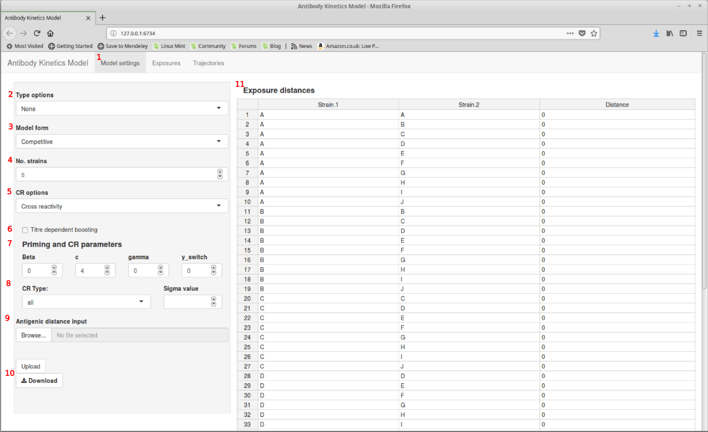
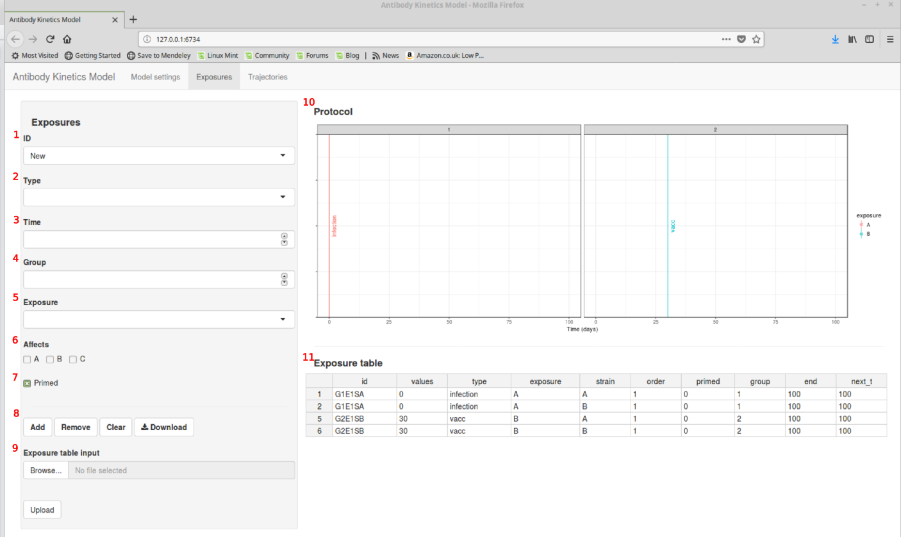
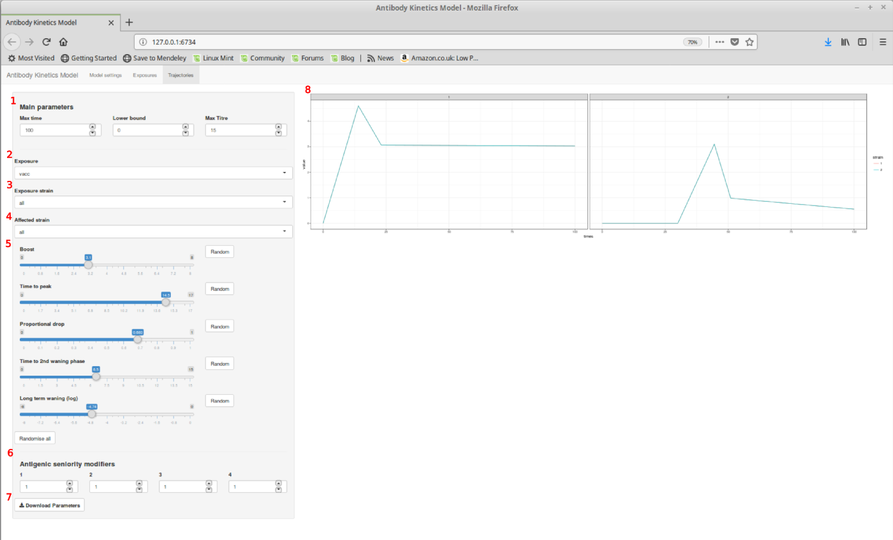

```{r setup, include = FALSE}
knitr::opts_chunk$set(
  collapse = TRUE,
  comment = "#>"
)
library(antibodyKinetics)
```

This vignette provides a brief bit of documentation regarding how to use the parameter viewer app for the [`antibodyKinetics`]("https://github.com/jameshay218/antibodyKinetics") package. The purpose of this app is to allow users generate parameter and exposure input tables with custom specified settings and exposure schedules. Through using the app, there will be options to download 3 .csv files that can be fed directly into the `antibodyKinetics` package code.

If you'd like to run this app (eg. see what titre trajectories would be generated given your own model structure and exposure schedule), the `shiny`, `shinyBS` and `rhandsontable` packages are required. The app can then be run with:

```r
paramViewer()
```

## Note
This **was not** developed as a piece of software to be released. Rather, it was developed for personal use and for a very keen user of the `antibodyKinetics` package to generate different models and exposure schedules. There is no guarantee that this app won't crash or generate slightly unexpected results. I recommend that you load it up and play around to get a feel for what it's doing, but don't worry if it crashes. If you run this from the R console, then *some* information will be printed as you run the app.

## 1. Model settings
The first tab allows the user to specify options for the model. You should see the following window upon starting the app:

{width=500px}

The key for these options is as follows:

1. Tabs for viewing different inputs/outputs
2. Specify if exposures are to be grouped by type or not. If left as "none", then parameters are generated for each unique exposure number, exposure strain and measured strain combination. Otherwise, each exposure of the same "type" elicits the same base response regardless of the exposure strain. *If this is set to something other than none, then the cross reactivity parameters will need to be specified.*
3. Competitive or isolated form of the model dictating how multiple exposures are combined to give a single titre trajectory per strain
4. How many strains are being measured in this experiment? Increasing or decreasing this value adds options and trackers for each strain in the experiment
5. Either "None" (no cross reactivity), "Cross reactivity" (antigenic distance mediated cross reactivity included, but the same for all exposure types) or "Typed CR" (different cross reactivity parameter for each exposure type).
6. Flag indicating if titre dependent boosting is present
7. Input area for priming, cross reactivity and titre dependent boosting parameters. If **6** is left unchecked, then `gamma` and `y_switch` can be ignored. Parameters correspond to those in the paper.
8. Dropdown to change the cross reactivity gradient for each exposure type (or all, if universal cross reactivity).
9. Input area for predefined antigenic distance matrix. Note that `Upload` must be pressed once the correct file is selected.
10. Download button for the current antigenic distance matrix
11. Antigenic distance matrix - values can be manually edited.
  
### Suggested example settings
Set the following to get going quickly:

  2. `Weak typing (3 types)`
  3. `Competitive`
  4. `3`
  5. `Cross reactivity`
  6. Unchecked
  7. `Beta=0.6; c=4; gamma=0; y_switch=0`
  8. `all`, `1`
  9. Leave blank
  10. NA
  11. Change the entries:
    - A, B = 1
    - A, C = 2
    - B, C = 2
  
## 2. Exposures
This tab allows the user to input exposure events of the desired type, time and to specify which strains are affected. By adding these exposures to the table, the expected antibody trajectories are constructed.

{width=500px}

Key:

1. Leave as "New" when adding new exposures, but can be use to select and modify previously added exposures.
2. Specify the type of exposure, if relevant.
3. Time of exposure in days.
4. Which experimental group does this exposure correspond to? The plots and table will change dynamically if more groups are added.
5. Which strain is in this exposure? Note that if you want a mixed exposure, different exposure events must be added for each strain (eg. different strains in a TIV)
6. Which strains does this exposure effect? Check the box for all strains that might cross react with the exposure strain (eg. same subtype)
7. Was this exposure a primed exposure? Check this if testing priming as a mechanism, and if this is a TIV exposure following infection
8. Add a new exposure to the table or remove a previously selected one. `Clear` removes all exposures from the table. `Download` downloads the table to the right as a .csv.
9. Upload a previously constructed exposure table. Be careful to ensure that this was an exposure table generated using the same options in the `Model settings` tab. `Upload` must be pressed after selecting the file
10. Schematic of the current protocol showing when and what exposures have been added, facetted by group.
11. The table that will be downloaded. Changes can be made manually.

Copy the exposure schedule in the example table - using "New" for each new exposure ID and matching the times and strains to the table; pressing "Add" for each new exposure. If you make a mistake, change the `ID` dropdown to the incorrect exposure and then press `Remove`.

## 3. Trajectories
Shows the expected titre trajectories given the options and exposure schedule specified on the previous tabs. The user may also change the model parameter values for each exposure using the sliders.

{width=500px}

Key:

1. Parameters to control the boundaries of the model - how long do we observe the sytem for, what's the lower limit of the assay (on a `log2` scale) and what is the maximum observable titre?
2. Dropdown to choose which exposure we are changing parameters for. 
3. Dropdown to select which strain for this exposure type we are considering (ie. the parameters that govern antibody titres of strain B following exposure with strain A) - this will be "all" as long as there is any typing in the model.
4. Dropdown to select which affected strain we are interested - only relevant if there is no cross-reactivity in the model, and any strain specific interactions must be parameterised explicitly. If there is cross reactivity, then the impact of an exposure on other strains is simply governed by their antigenic distance and cross-reactivity as specified in the `Model settings` tab.
5. Sliders to change the main model parameters. Note that long term waning rate is on the log scale. *Sorry - after changing each parameter, the "Exposure" dropdown changes back to the first exposure type. I have no plans to fix this, as it is just an inconvenience"*.
6. Change $\rho$, the antigenic seniority modifiers for each exposure. Note that this only goes up to 4 exposures at the moment - contact me if this is a problem! (It should just be a case of changing the code in ui.R).
7. Download the current parameter set.
8. Predicted antibody trajectories for the current set of inputs.

## Summary

* Use this app to generate expected antibody titres with a given exposure schedule and specified model options.
* Download the antigenic distance table, parameter table ("parTab.csv"), and exposure table ("exposureTab.csv") which can be used in the main code base of `antibodyKinetics`.
* It is possible to upload pre-existing exposure strategies, but this is left to the user to figure out (as it is unlikely this feature will be used).
